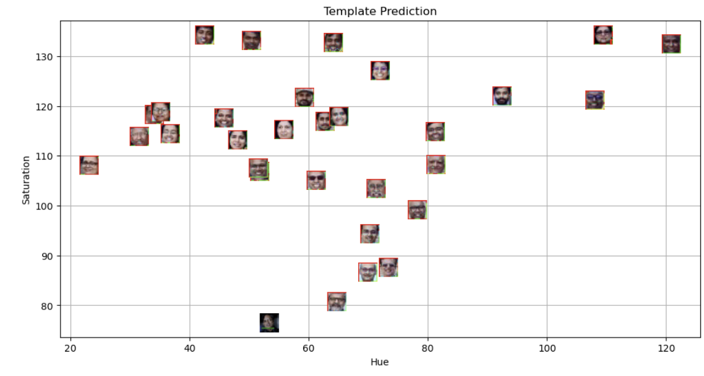

# Aim
This project uses K-means to detect, cluster, and classify faces based on Hue and Saturation.

## Project Overview

The objective of this project is to automate the categorization of faces from a group photograph using unsupervised learning. The system performs the following steps:

1. **Face Detection:** Uses Haar Cascade Classifiers to identify faces in a group image.
2. **Feature Extraction:** Converts detected face regions to the HSV color space and extracts mean Hue and Saturation values.
3. **Clustering:** Applies the K-Means algorithm to group faces into distinct clusters based on their feature vectors.
4. **Classification:** Detects a face in a target template image and predicts its cluster membership based on the trained model.

## Methodology and Findings

**Face Detection and Feature Extraction**
Faces are detected using the `haarcascade_frontalface_default.xml` classifier. 

**Template Prediction**
The system visualizes the template image relative to the existing clusters. The visual plot below shows the template face (bottom) relative to the faculty faces.

**Conclusion**
The K-Means algorithm (K=2) successfully separated the dataset into two distinct clusters. The template image (marked in thick green) was classified into Cluster 0 based on Euclidean distance to the centroids.

